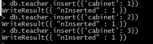
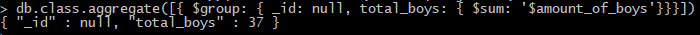

#Структура БД:

#Логи:

##Создание коллекций:

##teacher:

##class:

##timetable:

#Запросы:
1) select * from timetable;

;
2)select * from journal where pupil_id in (select pupil_id from pupil where class_id in (select class_id from class where class_id = 1));

3)select sum(amount_of_boys) as boys from class;

4)select sum(amount_of_girls) as girls from class;

5)select lesson_number, lesson_time from timetable where lesson_time >= all (select lesson_time from timetable);
