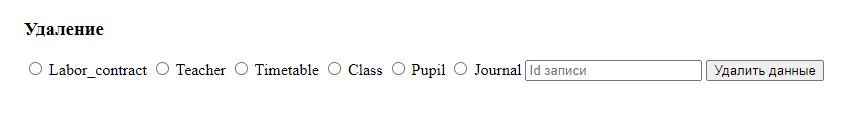

#Интерфейсы:

##Ввода данных в таблицу teacher:


##Удаления данных:


##Просмотра данных:


#Запросы:

##Query 1

```select * from labor_contract, teacher where teacher_id = 2 and teacher = 2;```


##Query 2

```select * from labor_contract where (select extract(month from hire) = 10) and teacher = 3;```


##Query 3

```select concat(pupil_id, ' - ', name) as id_name from pupil;```


##Query 4

```select * from pupil where pupil_id in (select pupil_id from journal where pupil_id = 1);```


##Query 5

``` select * from journal where pupil_id in (select pupil_id from pupil where class_id in (select class_id from class where class_id = 1));```

